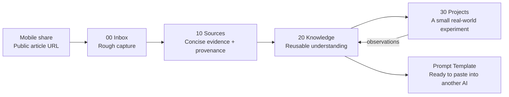
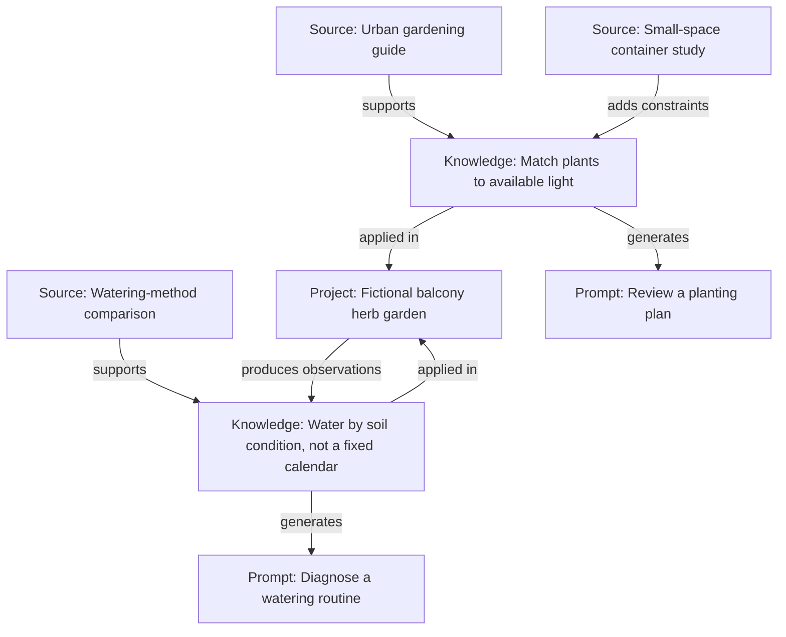

# Obsidian SecondBrain

An agent-maintained Obsidian vault that turns low-friction captures into connected, verifiable, reusable knowledge.

Drop rough notes, URLs, screenshots, PDFs, videos, or work updates into `00 Inbox`. Then ask Codex, Claude Code, or Cursor to organize the vault. The included skill reads the source material, removes noise, checks for duplicates, updates canonical notes, connects related ideas, and turns suitable Knowledge into ready-to-paste prompts for other AI applications.

The repository is a reusable system, not a published personal vault. Personal notes and attachments are ignored by Git by default; only the empty folder structure, agent instructions, skills, scripts, and project documentation are versioned.

## What it does

- Keeps capture friction low: write or drop anything into `00 Inbox`.
- Separates external evidence (`10 Sources`) from reusable synthesis (`20 Knowledge`).
- Reads URLs, images, PDFs, transcripts, and attachments when the active agent has the required tools.
- Compares fragments with existing notes instead of producing isolated summaries.
- Removes copied pages, comment dumps, OCR noise, tracking links, and processing text after useful content is safely integrated.
- Maintains traceable sources, uncertainty, meaningful wikilinks, and compact Obsidian properties.
- Produces prompt templates that can be pasted directly into another AI. They use the current conversation, attachments, or workspace automatically and ask only the minimum question when essential context is missing.
- Organizes courses and recurring work reviews, including evidence-backed development recommendations and a current technology radar.
- Re-runs safely: unchanged input should not create duplicate notes, sections, links, or prompts.

## What the knowledge graph can look like

The diagrams below use entirely fictional data. They illustrate relationships the organizer may create; they do not contain notes, topics, projects, or personal details from the maintainer's vault.

### From capture to reusable knowledge



### Example of evidence and ideas connecting



## Requirements

- [Obsidian](https://obsidian.md/) desktop.
- One supported coding agent: Codex, Claude Code, or Cursor.
- Git, only if you want to version the public framework.
- Recommended: Obsidian 1.12.7 or newer with **Settings → General → Command line interface** enabled. Obsidian CLI lets the agent inspect the vault and move or rename notes while preserving internal links. See the [official Obsidian CLI documentation](https://obsidian.md/help/cli).

No database, hosted service, embedding provider, or API key is required for the basic workflow.

## Start a new second brain

```bash
git clone https://github.com/sheng1111/Obsidian-SecondBrain.git
cd Obsidian-SecondBrain
```

1. Open the cloned folder as an Obsidian vault.
2. Enable Obsidian CLI if your installation supports it.
3. Open the same folder in Codex, Claude Code, or Cursor.
4. Put any rough capture in `00 Inbox`.
5. Tell the agent: `Organize my Inbox.`

You can capture in any language. Public project instructions are English, while organized notes should follow the language and conventions already used by the vault.

## Capture from your phone with Sync

If you use [Obsidian Sync](https://obsidian.md/help/sync), connect this vault on your phone and keep `00 Inbox` included in selective sync. You can then create rough notes directly in `00 Inbox` wherever you are; they will reach the same desktop vault and wait for the next organizing run.

On iOS or iPadOS, Obsidian's native Share Sheet can turn interesting pages, YouTube videos, and social posts into Inbox captures without manually copying their URLs. The native Share Sheet requires iOS or iPadOS 18 or newer and Obsidian 1.13.0 or newer.

1. From Safari or another app, tap **Share** and choose **Obsidian**.
2. Create a Share Sheet Location named `SecondBrain Inbox`.
3. Select this vault, choose **New note**, and set the folder to `00 Inbox`.
4. Choose whether shared web links should capture the URL or full text. Keeping the original URL is recommended for provenance.
5. Review the capture and tap **Save**.

See Obsidian's official [iOS and iPadOS Share Sheet guide](https://obsidian.md/help/ios) and [Sync setup guide](https://obsidian.md/help/sync/setup). Sync keeps devices aligned, but it is not a backup; maintain a separate backup and avoid using multiple sync systems on the same vault.

## Agent compatibility

### Codex

Open the repository as the workspace and ask Codex to organize the Inbox. `AGENTS.md` supplies the always-on vault rules, and the canonical skill lives at `.agents/skills/obsidian-inbox-organizer/`.

### Claude Code

Run `claude` from the repository root. `CLAUDE.md` points Claude to the shared rules, and the project skill is available under `.claude/skills/obsidian-inbox-organizer/`. Claude Code documents project skills under `.claude/skills/` in its [official Skills guide](https://code.claude.com/docs/en/skills).

### Cursor

Open the repository in Cursor and ask Agent to organize the Inbox. Cursor reads `AGENTS.md` and discovers project skills under `.agents/skills/`, as described in the [official Cursor Skills documentation](https://cursor.com/docs/skills).

## Vault structure

| Path | Purpose |
| --- | --- |
| `00 Inbox` | Unprocessed captures and unresolved material |
| `10 Sources` | Concise, traceable external evidence |
| `20 Knowledge` | Reusable synthesis, decisions, models, and prompt templates |
| `30 Projects/Courses` | Course hubs and lesson notes |
| `30 Projects/Work Reviews` | Periodic work evidence and annual overviews |
| `90 Archive` | Retained material removed from daily use |
| `99 System` | Local Bases, templates, and vault resources |
| `Attachments` | Images, PDFs, and other source files |

## Everyday workflow

Capture first. Do not stop to classify, tag, or rewrite information on your phone.

When ready, use one of these natural-language requests:

```text
Organize my Inbox.
```

```text
Organize the new captures and update any related Sources, Knowledge, projects, and work reviews.
```

```text
Refactor all existing Sources and Knowledge from scratch, merge overlaps, remove absorbed text noise, and preserve verifiable provenance.
```

The last request is intentionally explicit because a full refactor can rewrite many notes. Ordinary organization processes only the current Inbox snapshot and affected canonical notes.

## Ready-to-paste prompts

When a Knowledge note describes a repeatable task, the organizer maintains one `Prompt Template` section, or the localized equivalent already used by the vault. The prompt is designed to be copied as-is:

- no fill-in placeholders;
- reads the current chat, selected material, attachments, or workspace first;
- performs all work that can be inferred safely;
- asks one natural question, or at most three short questions, only when critical context is truly absent;
- preserves the safety, evidence, and authorization boundaries of the underlying Knowledge.

## Privacy by default

The personal content folders are ignored by Git. Each contains only a tracked `.gitkeep` file so a fresh clone has the correct structure.

Before any commit, verify that no personal note or attachment is staged:

```bash
git diff --cached --name-only
```

Never use `git add -f` on Inbox, Sources, Knowledge, Projects, Archive, System, or Attachments. If you decide to publish selected notes later, use a separate export workflow rather than weakening the vault-wide privacy defaults.

## Design principles

- Capture should be easier than organization.
- Sources preserve evidence; Knowledge preserves understanding.
- AI synthesis is labeled and never impersonates the user.
- A graph link must express a real relationship.
- New evidence updates canonical knowledge instead of creating another isolated summary.
- The second run on unchanged input should be a no-op.
- Research authorizes better notes, not installations, deployments, account actions, or production changes.

## Project status

This repository currently provides the vault skeleton, cross-agent instructions, the organizer skill, and a read-only inventory script. The workflow is intentionally local-first and does not upload vault content on its own.

## License

Obsidian SecondBrain is available under the [MIT License](LICENSE).
